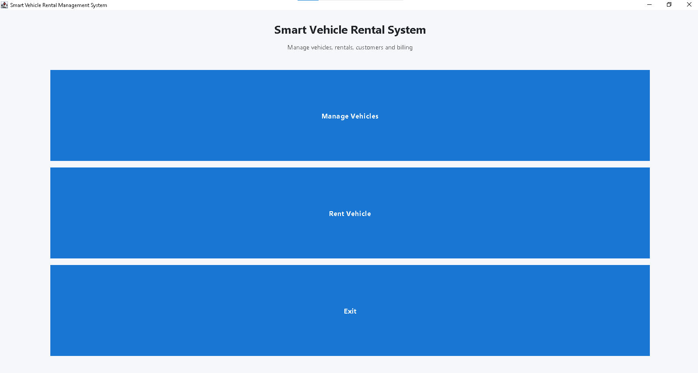
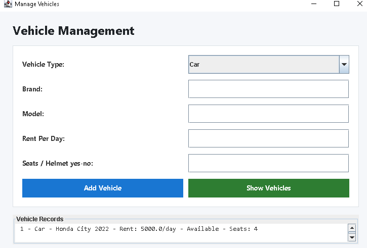
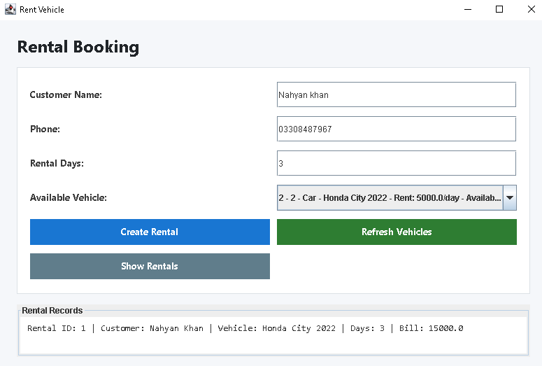

<div align="center">

<h1>🚗 Smart Vehicle Rental Management System</h1>

<h3>A Java Desktop Application Built with Java Swing & OOP Principles</h3>


<br><br>


</div>

---

## 📖 About The Project

**Smart Vehicle Rental Management System** is a fully functional Java desktop application that simplifies and organizes vehicle rental operations. Whether it's adding vehicles, registering customers, creating bookings, or generating bills — everything is handled through a clean and user-friendly GUI built with Java Swing.

This project was developed as part of the **Object Oriented Programming course** and demonstrates real-world application of core OOP concepts including inheritance, encapsulation, abstraction, and polymorphism.

---

## ✨ Features

| Feature | Description |
|---|---|
| 🚘 Vehicle Management | Add, view, and manage cars and bikes |
| 👤 Customer Registration | Store and manage customer details |
| 📅 Rental Booking | Create and track rental bookings |
| ✅ Availability Check | See which vehicles are currently available |
| 💰 Billing System | Auto-calculate bill based on rental days |
| 🖥️ Swing GUI | Clean, user-friendly desktop interface |

---

## 🖼️ Application Screenshots

### 🏠 Dashboard
> Main control panel — navigate to all modules from one place.




---

### 🚗 Vehicle Management
> Add cars and bikes, set daily rates, and monitor availability.



---

### 📋 Rental Management
> Create new bookings, assign vehicles to customers, and manage returns.



---

## 🧠 OOP Concepts Used

```
✔ Classes & Objects      — Vehicle, Customer, Rental, Car, Bike
✔ Inheritance            — Car & Bike extend Vehicle | Customer extends Person
✔ Encapsulation          — Private fields with Getters & Setters
✔ Abstraction            — Abstract classes: Vehicle, Person
✔ Polymorphism           — Billable interface implemented differently per vehicle type
✔ ArrayList              — Runtime data storage for vehicles, customers, rentals
```

---

## 📁 Project Structure

```
SmartVehicleRentalSystem/
│
├── 📂 model/
│   ├── Vehicle.java        ← Abstract base class for all vehicles
│   ├── Car.java            ← Extends Vehicle
│   ├── Bike.java           ← Extends Vehicle
│   ├── Customer.java       ← Customer data model
│   ├── Rental.java         ← Rental/booking record
│   └── DataStore.java      ← Central ArrayList storage
│
├── 📂 gui/
│   ├── DashboardForm.java  ← Main window with navigation
│   ├── VehicleForm.java    ← Vehicle management screen
│   └── RentalForm.java     ← Booking & billing screen
│
├── 📂 main/
│   └── Main.java           ← Entry point — run this file
```

---

## 🛠️ Technologies Used

- **Language:** Java (JDK 17+)
- **GUI Framework:** Java Swing
- **IDE:** Apache NetBeans
- **Data Storage:** ArrayList (in-memory)
- **Paradigm:** Object Oriented Programming

---

## 🚀 How to Run

### Option 1 — Clone from GitHub

```bash
# Step 1: Clone the repository
git clone https://github.com/DevNahyanK/SmartVehicleRentalSystem.git

# Step 2: Open the project folder
cd SmartVehicleRentalSystem
```

> Then follow the NetBeans steps below 👇

---

### Option 2 — Download ZIP

1. Click the green **`Code`** button on GitHub
2. Select **`Download ZIP`**
3. Extract the ZIP to any folder on your computer

---

### ▶️ Running in NetBeans

1. Open **NetBeans IDE**
2. Go to `File` → `Open Project`
3. Browse to the extracted/cloned project folder and select it
4. Click **Open Project**
5. In the Projects panel, find and open `main/Main.java`
6. Press **`F6`** or click the green ▶ Run button
7. The Dashboard window will launch ✅

> **Requirements:** Java JDK 17 or higher must be installed. Download from [oracle.com/java](https://www.oracle.com/java/technologies/downloads/)

---

## 👥 Group Members

| Name | Roll No | Program |
|---|---|---|
| Muhammad Nahyan Khan | 25FA-034-DS | Data Science |
| Ahmed Raza | 25FA-063-DS | Data Science |
| Haroon Rana | 25FA-002-DS | Data Science |
| Hamza Ahmed | 25FA-017-DS | Data Science |

---

## 📚 Course Information

> **Course:** Object Oriented Programming
> **Language:** Java
> **IDE:** NetBeans

---

<div align="center">

Made with Java 💙

</div>
